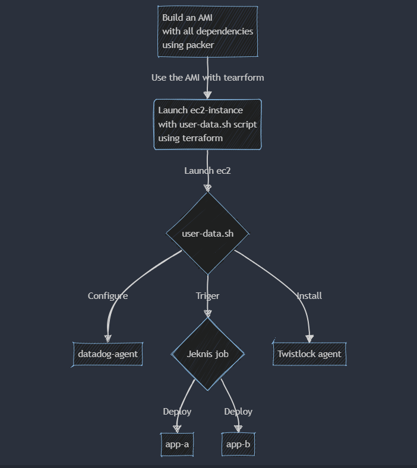

# README: Create and Use AMI with dependencies

## Table of Contents
1. [Introduction](#introduction)
2. [Prerequisites](#prerequisites)
3. [Packer Configuration - ec2](#packer-configuration---ec2)
    - [Validating the Packer Configuration](#validating-the-packer-configuration)
    - [Building the AMI](#building-the-ami)
4. [Flow Diagram](#flow-diagram)

## Introduction

This documentation provides a comprehensive guide on creating an Amazon Machine Image (AMI) using Packer for ec2 and sync instances on AWS. The guide also covers using the created AMI in Terraform to launch instances and configure them with a user data script.

## Prerequisites

Before you start, ensure you have the following:
- Packer installed on your machine
- Terraform installed on your machine
- AWS CLI configured with the necessary permissions
- Required variables and scripts for Packer and Terraform

## Packer Configuration - ec2

### Validating the Packer Configuration

To validate the Packer configuration, use the following command:

```
packer validate -var-file="pkrvars.hcl" golden_ami.pkr.hcl
```
This command checks the configuration file golden_ami.pkr.hcl using the variables defined in pkrvars.hcl to ensure there are no syntax errors or missing variables.

### Building the AMI
Once the configuration is validated, build the AMI with the following command:
```
packer build -var-file="pkrvars.hcl" golden_ami.pkr.hcl
```
This command will create an AMI in the AWS account with all the required dependencies for ec2 instances, it can be used in Terraform vars.tf to launch the instance

## Flow Diagram


### Explanation

#### 1. Build an AMI with all dependencies using Packer:
- Use Packer to create an AMI that includes all the necessary dependencies. The Packer script uses the variables defined in pkrvars.hcl to configure the build.

#### 2. Use the AMI with Terraform:
- Use the AMI created in the previous step and launch a ec2 EC2 instance using Terraform.
- The EC2 instance runs a user-data.sh script at launch to configure additional components.

#### 3. user-data.sh
- Configure the datadog-agent
- Trigger the Jenkins job
- Install and configure the twistlock agent

#### 4. Jenkins job: 
- Trigger the ec2 deployment
- Trigger the app-b deployment
- Trigger the ets-app-b deployment

For additional information on the terraform flow, see the [Terraform README](https://github.com/hemanthakumar97/Terraform-IaC/blob/main/ec2/README.md).


## Author

- [@Hemanth](https://github.com/hemanthakumar97)